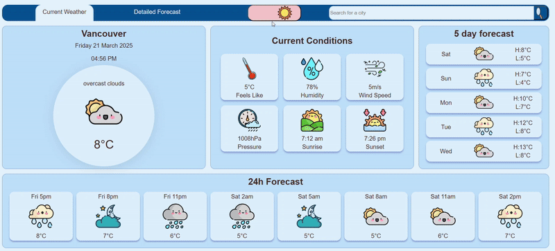
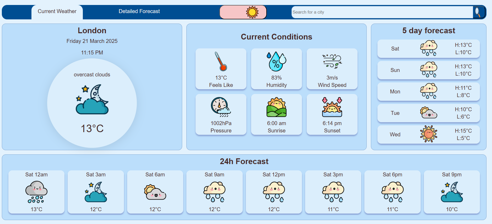
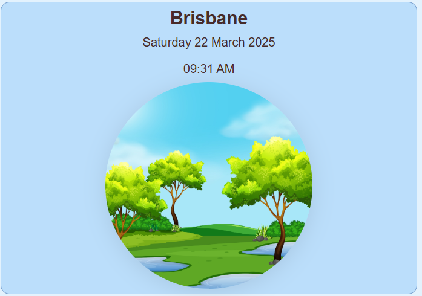
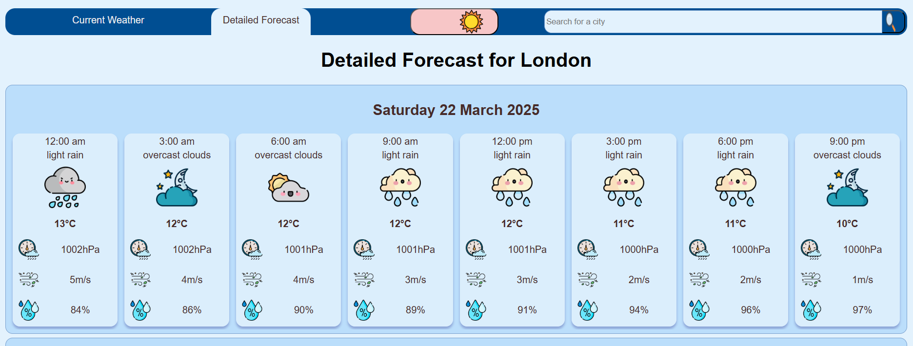
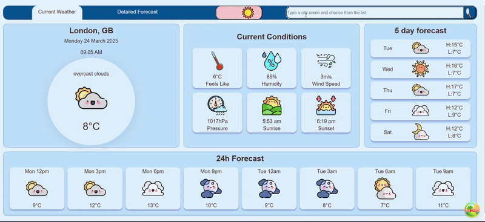
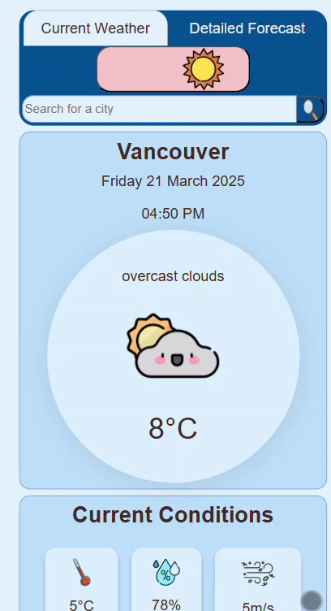
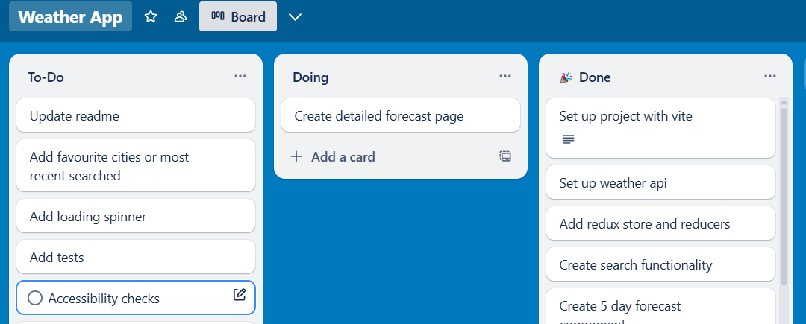
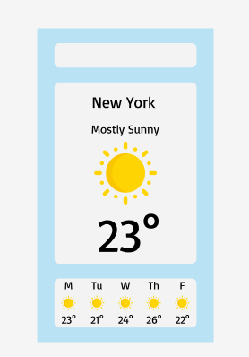

# Weather App

## How to run

This weather app SPA makes use of the free OpenWeatherMap API. To use this app:

1.) Clone the repo to your local machine

2.) Run npm install to install dependencies

3.) Go to [OpenWeatherMap](https://openweathermap.org/) and create a free account.

4.) In your dashboard, go to the API Keys section and create your key. Copy this.

5.) In the repo, create a file named `.env` at the root folder. Copy over:

VITE_APP_OPENWEATHER_API_KEY = ""

And inside the "" paste your API key.

6.) Type npm run dev into the terminal to start running the app.

## About the app

### Design

My weather app SPA has been designed with a cute and cartoony pastel palette. A toggle allows the user to switch between light and dark mode.

### Home Page

The homepage provides details about the current weather in the selected city, as well as a 24 hour and 5 day basic forecast. Hovering over the circular window on the home page displays a weather image according to the current weather.

### Detailed Forecast Page

The next tab along navigates to a detailed forecast page, where users can see a three-hourly detailed forecast for the next 5 days.

### City Search

The user can search for a city to find the current weather and forecast for that city. Times and dates are local time of the city selected. The city is remembered when navigating between the home and detailed forecast pages. Refreshing or starting a new session resets the city back to the default, which for the sake of this project is set to 'London'. However, future improvements could allow the user to set up a profile and choose their own 'home' city to default to.

### Responsive Design

This app has been developed to be viewed on desktop or mobile or tablet devices. Responsive design principles have been used to ensure the app is accessible on different devices such as media queries and relative sizes. For smaller screens, a horizontal scroll has been implemented for the forecast components.

### State Management

Redux and Redux Toolkit has been used to track state across the app. The theme (light or dark mode) as well as the current city being viewed is stored in the redux store. This was implemented to ensure a single point of truth and so that this could be accessed throughout the app without the need for prop drilling.

### Performance

The weather information is consumed from the free tier of the OpenWeatherMap API. React query is used to cache data of the current and weather forecasts for the cities searched for. This has been implemented to improve performance and reduce unnecessary repeated API calls.

## Process

A simple trello board was used to manage and prioritize tasks. With a limited time to complete the project, it was important to focus on the MVP.

A very basic figma wireframe was created at the ideation stage. While changes were later made to design, this initial stage helped to direct the development process e.g. prioritizing tasks, identifying common components.

## Future Improvements

I hope to add additional features in future such as the functionality for users to add places to their favourites, and history of recently searched places to be stored.
